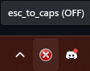
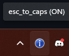

# Caps Lock to Escape: Script for Windows Vim Users

If you're a Windows user who relies on Vim and prefers to swap the functionality of the Escape key with Caps Lock, this script provides a convenient solution.

### Usage

To activate the script, simply press `WIN` + `ALT` + `C`. This will toggle the functionality between the normal mode and the swapped mode.
Pressing these buttons will display a 3seconds pop-up to notify that the buttons are toggled

In the normal mode, the keys function as usual. When toggled to the swapped mode, the Escape key acts as Caps Lock, and vice versa.

### Setting up Auto Startup

To ensure the script runs automatically every time you start your computer:

1. Press `WIN` + `R` to open the Run dialog.
2. Type `shell:startup` and press Enter. This will open the Windows Startup folder.
3. Move the `.exe` file of the script into this folder.
4. Restart your system to apply the changes.

This will enable the script to run in the background upon system startup, providing seamless functionality without manual activation.

### Feedback and Contributions

If you encounter any issues or have suggestions for improvement, feel free to reach out or submit a pull request. Your feedback is invaluable in enhancing the usability and effectiveness of this script for the Vim community on Windows.

### Known issues

1. Pressing `SHIFT` + `CAPSLOCK` when in swapped mode, the default `CAPSLOCK` behaviour will occur.
2. If you are playing, or in a full screen software, the pop-up will minimize the software ¯\_(ツ)\_/¯
